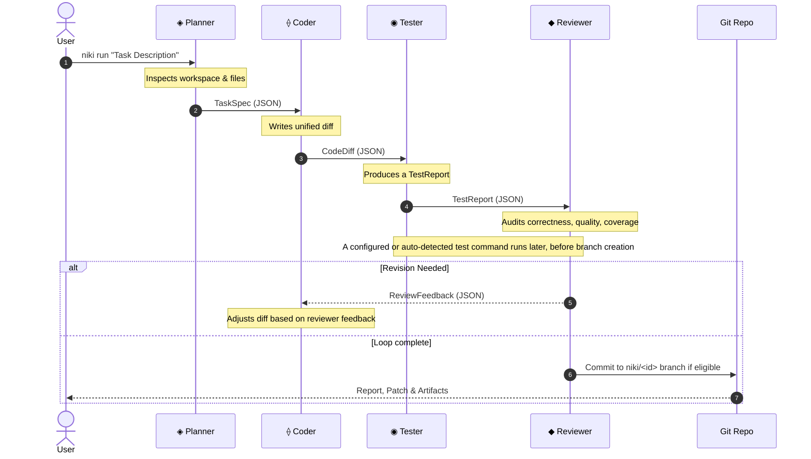

## Multi-Agent Pipeline Overview

NIKI's default topology is `auto`: low-complexity tasks collapse to Planner + solo Coder, while higher-complexity tasks use the full chain shown below.

---

## Artifact Contract

Agents never exchange unstructured conversation logs. Every stage takes a validated JSON input and produces a validated JSON output:

| Producer     | Consumer            | Artifact        | Schema / Purpose                                                              |
| ------------ | ------------------- | --------------- | ----------------------------------------------------------------------------- |
| **Planner**  | Coder               | `TaskSpec`      | Problem summary, files to touch, approach, acceptance criteria, constraints   |
| **Coder**    | Tester, Sandbox     | `CodeDiff`      | Search/replace hunk edits, rationale, spec adherence verification             |
| **Tester**   | Reviewer            | `TestReport`    | Proposed tests, analytical pass/fail summary, coverage assessment             |
| **Reviewer** | Orchestrator, Coder | `ReviewVerdict` | Approved / RevisionNeeded / Rejected, quality scores, granular feedback       |

Real test-runner output is separate: when a command resolves, the orchestrator writes `artifacts/test_execution.json` with the command, exit code, stdout, and stderr. If none resolves, `test_execution` is `None` and the report omits the execution section.

---

## Topology Modes

In `niki.toml`, you can configure how tasks route through the pipeline:

- **`auto` (default):** Uses the Planner's estimated complexity. `Low` (or below `single_agent_max_complexity`) collapses to Planner + solo Coder; larger tasks use Planner → Coder → Tester → Reviewer. Security, parallel, and High/Security-risk configurations can force the full chain.
- **`multiagent`:** Forces the full Planner → Coder → Tester → Reviewer sequence, with optional Red, Critic, Synthesizer, and Security Auditor stages.
- **`singleagent`:** Forces Planner + solo Coder and skips independent Tester/Reviewer/Red sessions.
