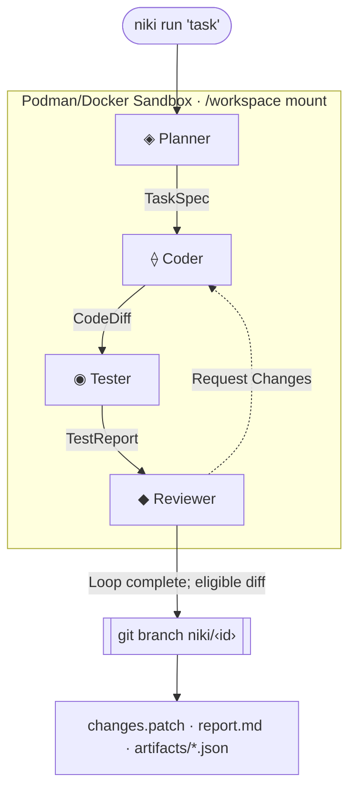

## NIKI

**Turn a sentence into a reviewable code change.**

NIKI v0.11.0 is an open-source multi-agent coding engine written in Go. Its default `auto` topology uses **Planner + solo Coder** for low-complexity tasks and **Planner → Coder → Tester → Reviewer** for higher-complexity runs. The default container backend executes against the repository bind-mounted at `/workspace`; a git-worktree backend is also available.

<Callout type="tip">
  **Your working tree is modified during eligible runs.** The container backend
  bind-mounts the repository at `/workspace`. The worktree backend isolates changes
  under `.niki-worktrees/<id>` and applies the final diff afterward. A branch is
  created only for a non-empty diff with no blocked test failure; `--force`
  records a forced branch as unverified.
</Callout>

```bash
niki run "Add a GET /health endpoint returning { status: 'ok', uptime }" --project ./my-app
```

```text
 ◈ ⟠ ◉ ◆   NIKI
   "Add a GET /health endpoint…"

 [Planner]   Done · Spec: 1 file to modify
  [Coder]     Done · Changed 1 file · src/main.go [modified]
 [Tester]    Done · 8/8 tests passed
 [Reviewer]  Done · Approved · correctness 10/10 · quality 9/10 · coverage 10/10
 [NIKI]      Task complete · Branch: niki/6d281d6d · Verdict: Approved · Revisions: 0
```

---

## Key Capabilities

<CardGroup cols={2}>
  <Card title="Multi-Agent Pipeline" icon="bot">
    The `auto` topology can collapse low-complexity work to Planner + solo Coder,
    while full runs add independent Tester and Reviewer sessions.
  </Card>
  <Card title="Sandboxed Execution" icon="shield-check">
    Docker/Podman containers bind-mount the project at `/workspace`. By default,
    socket discovery tries rootless before rootful; worktree runs use host processes.
  </Card>
  <Card title="BYOK & Multi-Provider" icon="key">
    Twelve user-facing slugs: Anthropic, OpenAI, OpenRouter, NVIDIA, Together,
    Groq, DeepSeek, Zen, Kimi, Kilo, Google, and Ollama.
  </Card>
  <Card title="Auditable & Verifiable" icon="file-text">
    Completed pipeline runs write `changes.patch`, `report.md`, and typed JSON
    artifacts under `.niki/tasks/<id>/` for inspection.
  </Card>
</CardGroup>

---

## How NIKI Works



---

## Quick Navigation

<CardGroup cols={3}>
  <Card title="Quickstart" href="/overview/quickstart" icon="zap">
    Set up NIKI, configure your provider keys, and run your first automated task
    in 5 minutes.
  </Card>
  <Card
    title="Agent Pipeline"
    href="/agent-pipeline/pipeline-overview"
    icon="git-pull-request"
  >
    Learn how Planner, Coder, Tester, and Reviewer interact and debate changes.
  </Card>
  <Card
    title="CLI Reference"
    href="/cli-reference/cli-overview"
    icon="terminal"
  >
    Explore all 28 CLI commands, flags, subcommands, and interactive TUI
    options.
  </Card>
</CardGroup>
